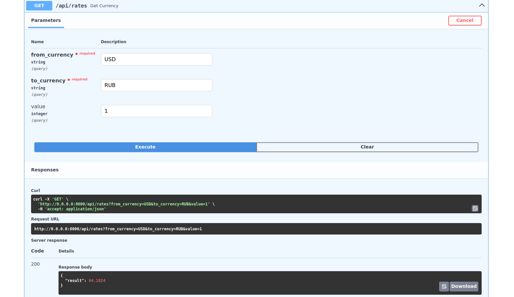

# Сервис конвертер валют.

#### Для запуска используйте docker:

        1. docker build .
        2. docker run -p 8000:8000 "image name/id"

#### Или в локальном репозитории, после установки зависимостей  `pip install -r requirements.txt`, используйте команду:

         python main.py

#### Сервис запуститься на `http://0.0.0.0:8000/docs#/`

#### Screenshot:
